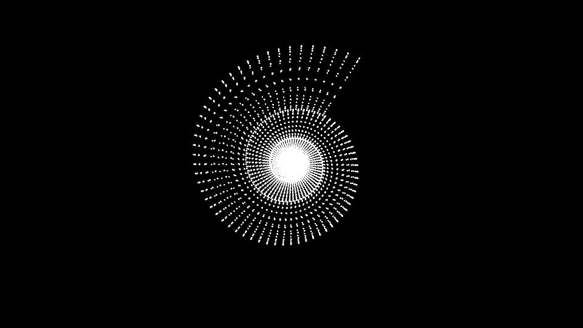
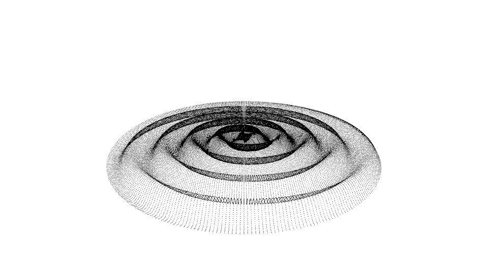
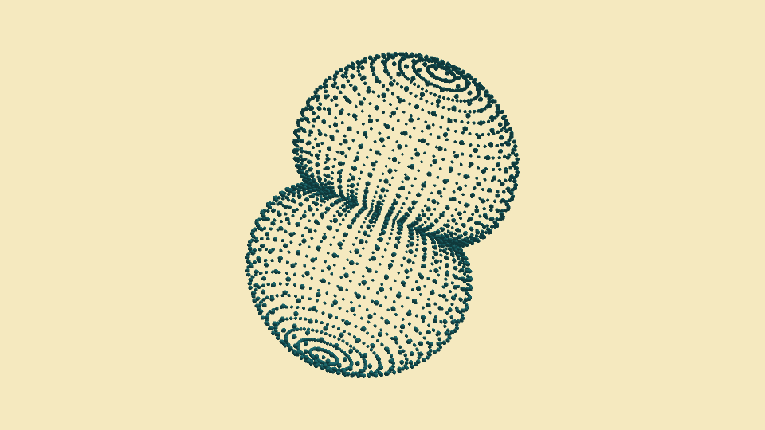
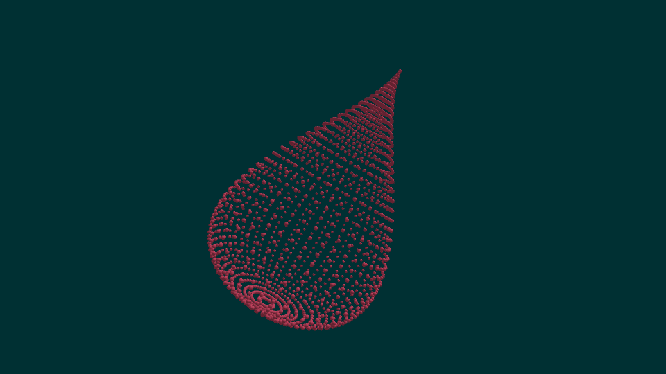

# Mathematics Formula / Processing

3D models from mathmatics formula, built with Processing(P5).

### Samples Index (Gif Animation)

* [index000-009](index000-009.md)
* [index010-019](index010-019.md)
* [index020-029](index020-029.md)
* [index030-039](index030-039.md)
