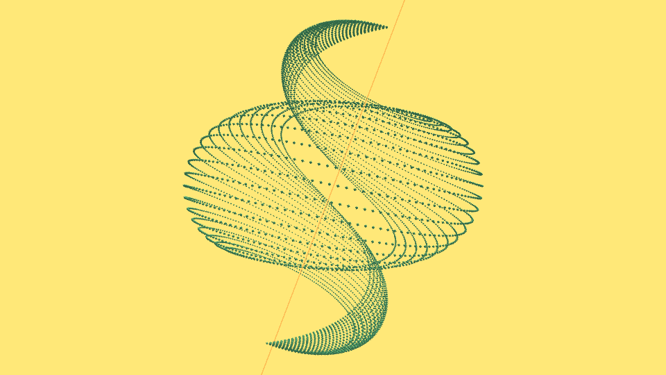

# Mathematics Formula / Processing

3D models from mathmatics formula, built with Processing(P5).

# reference: 

* 瑞慶山 香佳，数学デッサン教室 ― 描いて楽しむ数学のかたち,技術評論社，2019
* https://www.amazon.co.jp/dp/4297102781/

### Samples Index (Gif Animation)

* [index000-009](index000-009.md)
* [index010-019](index010-019.md)
* [index020-029](index020-029.md)
* [index030-039](index030-039.md)

### Samples

